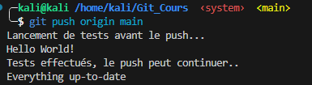
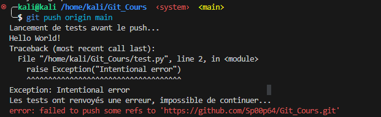

# Documentation GIT HOOK

## Quesqu'un GIT HOOK

Les Git Hooks sont des scripts automatisés exécutés à des moments clés (avant ou après certaines actions) dans Git, permettant d'ajouter des fonctionnalités personnalisées ou d'automatiser des tâches spécifiques lors des opérations comme les commits, les pushs, et les mises à jour sur un dépôt distant.

## Fonctionnalité souhaité 

Nous cherchons un moyen d'arreter le push si un script (ici en python) renvoie une erreur lors de l'execution.

## Comment utiliser les HOOK pour éviter un push

D'abord modifier ce fichier :

    .git/hooks/pre-push

 

    #!/bin/bash

    TEST_COMMAND="python3 test.py"

    echo "Lancement de tests avant le push..."
    if $TEST_COMMAND; then
        echo "Tests effectués, le push peut continuer.."
    else
        echo "Les tests ont renvoyés une erreur, impossible de continuer..."
        exit 1
    fin 

### Résultat
 
#### Si il n'y a pas d'erreur dans le script

#### Si il y a une erreur dans le script

